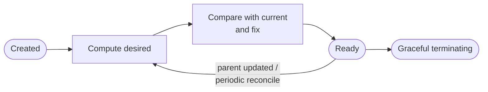
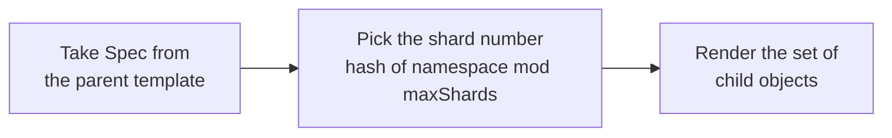
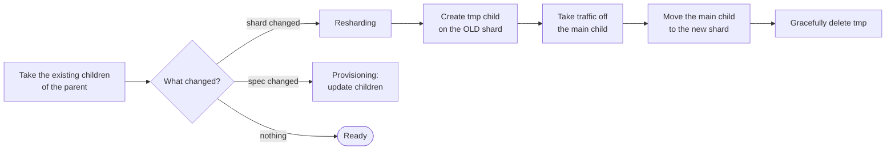

# Reconciliation lifecycle

The operator reconciles a parent custom resource (`ShardedIngress`,
`ShardedHTTPProxy`) into a set of child objects (`Ingress`, `HTTPProxy`)
placed on ingress-class shards. The loop is implemented once in
`internal/controller/engine.go` and follows this lifecycle:

Every mutating action (create, update, delete, annotation stamp) ends the
pass and requeues, so the loop applies one change at a time and each pass
starts from freshly observed state.

## Compute desired

- Shard selection: `internal/controller/shards.go` (`ShardSelector`). The
  namespace is hashed (xxhash) modulo the shard count of the class; with the
  `use-all-class-shards` annotation the parent is rendered on every shard.
- Rendering: `internal/controller/desired_ingress.go`,
  `desired_httpproxy.go` (`DesiredRenderer`). Renderers are pure — the engine
  resolves the migration context (see below) before they run.

## Compare with current and fix

The branch taken is mirrored to `status.phase`
(`Pending / Provisioning / Resharding / Ready / Terminating`), to the
`Ready` and `Resharding` conditions, and to kube events on the parent
(`ChildCreated`, `ChildUpdated`, `ChildDeleted`, `TmpChildCreated`,
`ReshardingStarted`, `MarkedForDeletion`, `DeletionScheduled`,
`ApplyScheduled`, `FinalizerDraining`, `FinalizerRemoved`).

### Resharding timeline

Migration mechanics live in `internal/controller/migration.go` and are driven
by two child annotations and the base window `T`
(`rateLimit.updateCooldown.object`):

| Time    | What happens |
|---------|--------------|
| `t0`    | tmp child is created on the **old** shard (`old-shard` annotation records where from); the main child keeps the old class; tmp is stamped `auto-delete-after = t0+3T` |
| `t0+T`  | the main child switches to the **new** shard; tmp keeps serving the old shard while DNS/service discovery converges |
| `t0+2T` | tmp is marked for service-discovery unregistering (`marked-for-deletion` annotation) |
| `t0+3T` | tmp is deleted |

The same `auto-delete-after`/unregister sequence (with a `2T` window) is used
for any child that is no longer desired, and — with
`finalizer.deletionTerminationPeriod` — for draining children when the parent
is deleted (`Terminating` phase): the finalizer is removed only after every
child is unregistered and deleted.

## Rate limiting

Before mutating anything, a pass books a slot from the `Scheduler`
(`internal/controller/scheduler.go`). The current implementation keeps the
historical behavior: creations/updates on one shard are spaced by
`rateLimit.updateCooldown.shard`, deletions are grouped into
`T`-sized windows, protecting the ingress controllers from config-reload
storms. The booking is announced with an `ApplyScheduled` event. A fair
per-shard queue can replace this implementation behind the same interface.

## Code map

| Concern | Where |
|---------|-------|
| Lifecycle engine (one generic `Reconcile`) | `internal/controller/engine.go` |
| Interfaces (`ChildAdapter`, `DesiredRenderer`, `ShardSelector`, `Scheduler`) | `internal/controller/interfaces.go` |
| Shard selection | `internal/controller/shards.go` |
| Desired-state rendering | `internal/controller/desired_*.go` |
| Child compare/merge per type | `internal/controller/adapter_*.go` |
| Migration timeline & annotations | `internal/controller/migration.go` |
| Rate limiting | `internal/controller/scheduler.go` |
| Status bookkeeping, conditions, events | `internal/controller/status.go` |
| In-memory lists & metrics | `internal/controller/tracker.go` |
| Thin per-type controllers | `internal/controller/{ingress,httpproxy}_reconciler.go` |
